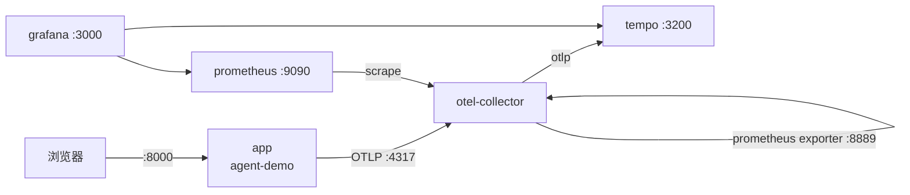

# 可观测性系统 Demo 部署与使用文档

> 将 `agent-demo` 整套可观测性系统（应用 + OpenTelemetry Collector + Tempo + Prometheus + Grafana）迁移并部署到另一台机器。

## 1. 文档信息

| 项 | 内容 |
| --- | --- |
| 文档名称 | 可观测性系统 Demo 部署与使用文档 |
| 版本 | v1.0 |
| 适用项目 | agent-demo（含 `deploy/` 监控栈） |
| 部署方式 | Docker Compose（单机多容器） |
| 关联文档 | `docs/observability-prd.md`、`docs/multi-container-observability-plan.md` |
| 仓库 | `git@github.com:LyXiaoYao/agent-demo.git` |

---

## 2. 系统组成



| 服务 | 镜像 | 宿主端口 | 作用 |
| --- | --- | --- | --- |
| app | `agent-demo-observability-app`（本地构建） | 8000 | Agent Web 应用（FastAPI + SSE） |
| otel-collector | `otel/opentelemetry-collector-contrib:0.111.0` | 4317(gRPC) / 4318(HTTP) / 8889(指标) | 遥测接收、处理、导出 |
| tempo | `grafana/tempo:2.6.1` | 3200 | Trace 存储 |
| prometheus | `prom/prometheus:v2.55.0` | 9090 | 指标存储与查询 |
| grafana | `grafana/grafana:11.3.0` | 3000 | 可视化（匿名 Admin） |

**命名卷**：`agent-demo-observability_tempo-data`、`agent-demo-observability_prometheus-data`、`agent-demo-observability_grafana-data`

**目录结构（需迁移的内容）**

```
agent-demo/
├── .env                 # 必须：环境变量（含 API Key），不随 git 同步
├── .env.example         # 模板
├── pyproject.toml
├── README.md
├── src/agent_demo/      # 应用源码（含 telemetry.py）
├── deploy/              # 监控栈
│   ├── docker-compose.yml
│   ├── Dockerfile
│   ├── otel-collector/config.yaml
│   ├── tempo/tempo.yaml
│   ├── prometheus/prometheus.yml
│   └── grafana/{provisioning,dashboards}/
└── docs/                # 文档（可选）
```

> 无需迁移：`.venv/`、`__pycache__/`、`*.egg-info/`（容器内会重新安装）。

---

## 3. 前置条件

### 3.1 硬件建议

| 项 | 最低 | 推荐 |
| --- | --- | --- |
| CPU | 2 核 | 4 核+ |
| 内存 | 4 GB | 8 GB+ |
| 磁盘 | 20 GB | 50 GB+（遥测数据会增长） |

### 3.2 软件

| 软件 | 版本 | 说明 |
| --- | --- | --- |
| Docker Engine | ≥ 24 | 必须 |
| Docker Compose | v2（`docker compose`） | 必须 |
| 操作系统 | Linux / macOS / Windows(WSL2) | 任意支持 Docker 的系统 |
| curl | 任意 | 验证用 |

**Windows / WSL2 特别注意**：若使用 Docker Desktop，必须在
`Settings → Resources → WSL Integration` 中为对应发行版开启集成，否则 WSL 内提示
`The command 'docker' could not be found`。开启后新开一个终端验证：

```bash
docker version
docker compose version
```

### 3.3 网络与凭据

| 需求 | 用途 |
| --- | --- |
| 访问 Docker Hub | 拉取 collector/tempo/prometheus/grafana/python 基础镜像 |
| 访问 PyPI | 构建 app 镜像时 `pip install`（离线方案见 §7） |
| 访问 LLM API | 应用实际问答（OpenAI / DeepSeek / vLLM 等） |
| LLM API Key | 写入 `.env` 的 `OPENAI_API_KEY` |

---

## 4. 快速开始（TL;DR）

```bash
# 1) 获取代码
git clone git@github.com:LyXiaoYao/agent-demo.git
cd agent-demo

# 2) 配置环境变量
cp .env.example .env
#    编辑 .env，至少填写 OPENAI_API_KEY（如用第三方网关再填 OPENAI_BASE_URL / MODEL_NAME）

# 3) 构建并启动整套栈
docker compose -f deploy/docker-compose.yml up -d --build

# 4) 验证
docker compose -f deploy/docker-compose.yml ps
curl -s http://localhost:8000/ -o /dev/null -w "%{http_code}\n"
```

打开 http://localhost:8000 提问，然后访问 http://localhost:3000 查看仪表盘。

---

## 5. 迁移方式选择

| 方式 | 适用 | 是否需外网 | 是否保留历史数据 |
| --- | --- | --- | --- |
| **A. 源码迁移**（推荐） | 目标机可访问 Docker Hub / PyPI | 需要 | 否 |
| **B. 镜像离线迁移** | 内网、无外网 | 不需要 | 否 |
| **C. 数据卷迁移** | 需保留已有遥测/仪表盘 | 视情况 | 是 |

三种方式可组合使用，例如：B（镜像）+ A 的配置方式 + C（数据）。

---

## 6. 方式 A：源码迁移（联网）

### 6.1 获取代码

```bash
# 方式一：Git 克隆
git clone git@github.com:LyXiaoYao/agent-demo.git
cd agent-demo

# 方式二：从源机打包拷贝（推荐同时排除虚拟环境）
#   源机执行：
tar --exclude='.venv' --exclude='__pycache__' --exclude='*.egg-info' -czf agent-demo.tgz agent-demo
#   目标机执行：
tar -xzf agent-demo.tgz && cd agent-demo
```

### 6.2 配置环境变量

```bash
cp .env.example .env
```

编辑 `.env`：

```ini
OPENAI_API_KEY=sk-xxx                         # 必填
OPENAI_BASE_URL=https://your-gateway/v1       # 可选，第三方 OpenAI 兼容网关
MODEL_NAME=DeepSeek-V4-Flash                  # 可选，默认 gpt-4o-mini

OTEL_ENABLED=true
OTEL_SERVICE_NAME=agent-demo
# 注意：容器内 app 由 compose 覆盖为 http://otel-collector:4317，此处可保持默认
OTEL_EXPORTER_OTLP_ENDPOINT=http://localhost:4317
OTEL_METRIC_EXPORT_INTERVAL=10000
LLM_INCLUDE_USAGE=true
```

> `deploy/docker-compose.yml` 的 `app` 服务通过 `env_file: ../.env` 读取该文件；
> 容器内 OTLP 端点由 compose 的 `environment` 覆盖为 `http://otel-collector:4317`，无需手工改。

### 6.3 构建并启动

```bash
docker compose -f deploy/docker-compose.yml up -d --build
```

首次会拉取基础镜像并构建 app 镜像（需数分钟）。查看状态：

```bash
docker compose -f deploy/docker-compose.yml ps
```

预期 5 个服务均为 `Up`。

### 6.4 验证

见 §9 验证清单。

---

## 7. 方式 B：镜像离线迁移（内网/无外网）

在**源机**（已成功运行）导出镜像，拷到目标机导入，避免重新构建。

### 7.1 源机导出

```bash
docker save \
  otel/opentelemetry-collector-contrib:0.111.0 \
  grafana/tempo:2.6.1 \
  prom/prometheus:v2.55.0 \
  grafana/grafana:11.3.0 \
  agent-demo-observability-app:latest \
  python:3.12-slim \
  -o agent-observability-images.tar

# 可选：压缩
gzip -k agent-observability-images.tar
```

> `python:3.12-slim` 仅当目标机仍需重新构建 app 时才需要；若直接使用导出的 app 镜像可省略。
> 确认 app 镜像名：`docker images | grep agent-demo`（应为 `agent-demo-observability-app:latest`）。

### 7.2 目标机导入

```bash
gunzip -k agent-observability-images.tar.gz   # 若已压缩
docker load -i agent-observability-images.tar
docker images | grep -E "agent-demo|tempo|prometheus|grafana|opentelemetry"
```

### 7.3 启动（不重新构建）

```bash
# 仍需 .env 与 deploy/ 目录（源码迁移中至少保留这两项）
docker compose -f deploy/docker-compose.yml up -d --no-build
```

若 `--no-build` 未生效，可在 `deploy/docker-compose.yml` 的 `app` 服务中显式指定：

```yaml
  app:
    image: agent-demo-observability-app:latest   # 新增
    build:
      context: ..
      dockerfile: deploy/Dockerfile
```

---

## 8. 方式 C：数据卷迁移（保留历史遥测）

> 仅在需要保留已有 Trace/指标/仪表盘状态时使用；全新部署可跳过。

### 8.1 源机导出

```bash
# 建议先停止写入
docker compose -f deploy/docker-compose.yml stop

for v in tempo-data prometheus-data grafana-data; do
  docker run --rm \
    -v agent-demo-observability_${v}:/data:ro \
    -v "$(pwd)":/backup \
    alpine tar czf /backup/${v}.tgz -C /data .
done

# 会生成 tempo-data.tgz / prometheus-data.tgz / grafana-data.tgz
```

### 8.2 目标机导入

```bash
# 先创建卷（可先 up 一次再 down，或用 docker volume create）
docker volume create agent-demo-observability_tempo-data
docker volume create agent-demo-observability_prometheus-data
docker volume create agent-demo-observability_grafana-data

for v in tempo-data prometheus-data grafana-data; do
  docker run --rm \
    -v agent-demo-observability_${v}:/data \
    -v "$(pwd)":/backup \
    alpine sh -c "cd /data && tar xzf /backup/${v}.tgz"
done

docker compose -f deploy/docker-compose.yml up -d
```

---

## 9. 验证清单

### 9.1 服务状态与端口

```bash
docker compose -f deploy/docker-compose.yml ps
```

| 检查项 | 命令 | 期望 |
| --- | --- | --- |
| App | `curl -s -o /dev/null -w "%{http_code}" http://localhost:8000/` | `200` |
| Grafana | `curl -s -o /dev/null -w "%{http_code}" http://localhost:3000/api/health` | `200` |
| Prometheus | `curl -s -o /dev/null -w "%{http_code}" http://localhost:9090/-/ready` | `200` |
| Tempo | `curl -s -o /dev/null -w "%{http_code}" http://localhost:3200/ready` | `200`（刚启动可能短暂 `503`，稍等） |

> **Windows PowerShell 注意**：`Invoke-WebRequest` 会走系统代理导致超时，请用
> `curl.exe --noproxy "*" http://localhost:8000/`。

### 9.2 产生数据并验证闭环

```bash
# 1) 发一条问答（Linux/macOS）
curl -s -N -X POST http://localhost:8000/api/chat \
  -H "Content-Type: application/json" \
  -d '{"message":"请用计算器算一下 12*7 等于多少"}'
```

```powershell
# Windows PowerShell：用文件传 body，避免引号被吞
'{"message":"请用计算器算一下 12*7 等于多少"}' | Set-Content -Encoding utf8 chat.json
curl.exe -s --noproxy "*" -N -X POST http://localhost:8000/api/chat -H "Content-Type: application/json" --data-binary "@chat.json"
```

预期看到 SSE 事件：`session` → `tool`(calculator) → `tool_result`(84) → `text`… → `done`。

```bash
# 2) 等待约 10~15s（指标导出间隔），查 Prometheus
curl -s "http://localhost:9090/api/v1/query?query=agent_requests_total"
curl -s "http://localhost:9090/api/v1/query?query=agent_tokens_total"
curl -s "http://localhost:9090/api/v1/query?query=agent_tool_calls_total"

# 3) 查 Tempo 是否有链路
curl -s "http://localhost:3200/api/search?tags=service.name%3Dagent-demo&limit=5"
```

### 9.3 Grafana

- 访问 http://localhost:3000（匿名 Admin，无需登录）。
- 左侧 **Dashboards → agent-demo → agent-demo Observability** 查看面板。
- **Explore** 选择 `Tempo`，执行 TraceQL：`{ resource.service.name = "agent-demo" }`。

---

## 10. 使用说明

### 10.1 Web 问答

- 打开 http://localhost:8000，在输入框提问，回答流式逐字显示。
- 触发工具调用时会插入“调用工具 / 结果”提示条。
- 同一页面会话共享 `session_id`，保持多轮上下文。

### 10.2 Grafana 仪表盘

| 面板 | 含义 |
| --- | --- |
| Total requests | 累计问答请求数 |
| Error rate | 错误请求占比 |
| LLM latency p95 | LLM 调用 P95 延迟 |
| Request rate by status | 按状态（success/error）的请求速率 |
| LLM latency quantiles | LLM 延迟 p50/p95/p99 |
| Token usage rate by type | 输入/输出 token 速率 |
| Tool calls by tool | 各工具调用速率 |
| Traces | TraceQL 查询指引 |

### 10.3 关闭/开启遥测

```bash
# 关闭：编辑 .env 设 OTEL_ENABLED=false，然后
docker compose -f deploy/docker-compose.yml up -d app
```

### 10.4 常用运维命令

```bash
docker compose -f deploy/docker-compose.yml ps                 # 状态
docker compose -f deploy/docker-compose.yml logs -f app        # 应用日志
docker compose -f deploy/docker-compose.yml logs -f otel-collector
docker compose -f deploy/docker-compose.yml restart app        # 重启单个服务
docker compose -f deploy/docker-compose.yml down               # 停止并删除容器（保留卷）
docker compose -f deploy/docker-compose.yml up -d              # 再启动
docker compose -f deploy/docker-compose.yml down -v            # 停止并删除卷（清空数据，慎用）
```

---

## 11. 配置说明

### 11.1 环境变量（`.env`）

| 变量 | 默认 | 说明 |
| --- | --- | --- |
| `OPENAI_API_KEY` | 无 | LLM 密钥（必填） |
| `OPENAI_BASE_URL` | 空 | 第三方 OpenAI 兼容网关地址 |
| `MODEL_NAME` | `gpt-4o-mini` | 模型名 |
| `OTEL_ENABLED` | `true` | 遥测总开关 |
| `OTEL_SERVICE_NAME` | `agent-demo` | 服务名（Grafana 过滤依据） |
| `OTEL_EXPORTER_OTLP_ENDPOINT` | `http://localhost:4317` | OTLP 端点（容器内被 compose 覆盖） |
| `OTEL_METRIC_EXPORT_INTERVAL` | `10000` | 指标导出间隔（ms） |
| `LLM_INCLUDE_USAGE` | `true` | 是否请求流式 token 用量 |

### 11.2 修改端口

编辑 `deploy/docker-compose.yml` 左侧端口，例如把 Grafana 改为 3001：

```yaml
  grafana:
    ports:
      - "3001:3000"     # 宿主 3001 -> 容器 3000
```

改完执行 `docker compose -f deploy/docker-compose.yml up -d`。

### 11.3 应用在宿主机、监控在 Docker（混合模式）

```bash
# 1) 只启动监控栈（注释/跳过 app 服务）
docker compose -f deploy/docker-compose.yml up -d otel-collector tempo prometheus grafana

# 2) 宿主机运行应用（需 Python 3.10+）
python -m venv .venv && source .venv/bin/activate
pip install -e .
agent-web          # 默认 http://127.0.0.1:8000，上报 localhost:4317
```

### 11.4 上报到外部 Collector

若目标机已有统一 Collector，可在 `.env` 设置
`OTEL_EXPORTER_OTLP_ENDPOINT=http://<collector-host>:4317`，并只部署 app。

---

## 12. 故障排查

| 现象 | 原因 | 解决 |
| --- | --- | --- |
| `docker: command not found`（WSL） | Docker Desktop 未开启 WSL 集成 | Settings → Resources → WSL Integration 勾选该发行版，重开终端 |
| 构建 app 报 `failed to fetch anonymous token ... python:3.12-slim` | Docker Hub 网络抖动 | `docker pull python:3.12-slim` 重试；或改用 §7 离线镜像 |
| `docker compose ps` 中 app 只有 `8000/tcp`，无 `0.0.0.0:8000->8000` | 宿主 8000 被占用（如本机 `agent-web`） | 停掉占用进程后 `docker compose ... up -d --force-recreate app` |
| PowerShell `Invoke-WebRequest` 请求超时 | 系统代理拦截 | 用 `curl.exe --noproxy "*"` |
| Tempo `/ready` 返回 503 | 刚启动尚未就绪 | 等待 10~30s 后重试 |
| Grafana 无数据 | 指标导出间隔未到 / 未产生请求 | 发一条问答，等 10~15s，确认 `OTEL_ENABLED=true` |
| Collector 日志报连接 tempo 失败 | 依赖未就绪 | `docker compose ... restart otel-collector` |
| Grafana 提示 plugins/alerting 目录不存在 | 未挂载对应 provisioning 目录 | 属正常日志，可忽略 |
| 应用容器反复重启 | `.env` 缺失或 `OPENAI_API_KEY` 无效 | 确认 `.env` 存在且 key 正确，查看 `logs app` |

**查看所有服务日志**：

```bash
docker compose -f deploy/docker-compose.yml logs --tail 50
```

---

## 13. 升级与卸载

### 13.1 升级

```bash
git pull                                          # 或替换源码
docker compose -f deploy/docker-compose.yml up -d --build
```

### 13.2 卸载

```bash
# 停止并删除容器与网络（保留数据卷）
docker compose -f deploy/docker-compose.yml down

# 连数据卷一起删除（清空所有遥测与 Grafana 状态）
docker compose -f deploy/docker-compose.yml down -v

# 删除镜像（可选）
docker rmi agent-demo-observability-app:latest
```

---

## 14. 附录

### 14.1 组件版本

| 组件 | 版本 |
| --- | --- |
| Python（构建基础镜像） | 3.12-slim |
| OpenTelemetry Collector Contrib | 0.111.0 |
| Tempo | 2.6.1 |
| Prometheus | v2.55.0 |
| Grafana | 11.3.0 |
| OpenTelemetry SDK（应用） | ≥ 1.27 |

### 14.2 部署检查清单

- [ ] 目标机安装 Docker 与 Compose v2
- [ ] （WSL）已开启 Docker Desktop WSL 集成
- [ ] 已创建 `.env` 且 `OPENAI_API_KEY` 有效
- [ ] `docker compose up -d --build` 成功，5 个服务均 `Up`
- [ ] 四个端口（8000/3000/9090/3200）可访问
- [ ] 发一条问答后，Prometheus 有 `agent_requests_total`
- [ ] Tempo 能检索到 `service.name=agent-demo` 的 Trace
- [ ] Grafana 能看到 `agent-demo Observability` 仪表盘
- [ ] （离线）已导入镜像并用 `--no-build` 启动
- [ ] （保数据）已迁移三个数据卷

### 14.3 端口一览

| 端口 | 服务 | 用途 |
| --- | --- | --- |
| 8000 | app | Web 问答页面 / SSE API |
| 3000 | grafana | 仪表盘 |
| 9090 | prometheus | 指标查询 UI |
| 3200 | tempo | Trace 查询 API |
| 4317 | otel-collector | OTLP gRPC |
| 4318 | otel-collector | OTLP HTTP |
| 8889 | otel-collector | Prometheus 指标端点 |
