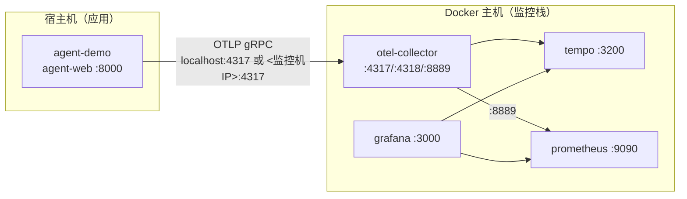

# 混合部署迁移方案：应用在宿主机 + 监控栈用 Docker

> 场景：**app 不使用 Docker**（在宿主机以进程/虚拟环境/systemd 运行），
> **OpenTelemetry Collector / Tempo / Prometheus / Grafana 仍用 Docker 部署**。

## 1. 适用场景

| 场景 | 说明 |
| --- | --- |
| 本地开发调试 | 改应用代码即时生效，不必每次重建镜像 |
| 宿主机有 GPU / 特殊依赖 | 应用依赖宿主机环境，不适合容器化 |
| 逐步容器化 | 先把监控栈容器化，应用后续再迁移 |
| 资源受限 | 省去 app 容器的构建与运行开销 |

> 本文档是 `docs/deployment-guide.md` 的补充，术语与端口沿用该文档。

## 2. 架构与网络



**网络要点**

- Collector 的 OTLP 端口（4317/4318）已发布到 Docker 宿主机，宿主机上的应用可通过 `localhost` 访问。
- 应用与监控栈**不在同一台机器**时，应用需指向监控机的内网 IP，并放行 4317 端口。
- 应用端口 8000 由宿主机进程占用，**不要**再让 app 容器占用（见 §7）。

## 3. 与全容器模式的差异

| 项 | 全容器 | 混合模式 |
| --- | --- | --- |
| app 运行位置 | Docker 容器 | 宿主机进程 |
| app OTLP 端点 | `http://otel-collector:4317`（容器网络） | `http://localhost:4317` 或 `<监控机IP>:4317` |
| app 依赖安装 | 镜像内 pip | 宿主机 venv `pip install -e .` |
| 编排文件 | `deploy/docker-compose.yml` | `deploy/docker-compose.infra.yml` |
| 数据卷 | 三卷共享 | **同名项目、同名卷**，数据延续 |
| 启动命令 | `up -d --build` | `up -d`（无需构建） |

## 4. 前置条件

**监控机（Docker）**：Docker Engine + Compose v2。

**应用机（宿主机）**：

- Python ≥ 3.10（3.13 亦可）。
- 可访问监控机的 4317 端口。
- 可访问 LLM API（`OPENAI_BASE_URL` / `OPENAI_API_KEY`）。

## 5. 同机混合部署（推荐）

### 5.1 启动监控栈

```bash
cd agent-demo

# 仅启动 4 个监控服务（不含 app）
docker compose -f deploy/docker-compose.infra.yml up -d

docker compose -f deploy/docker-compose.infra.yml ps
```

预期：`otel-collector / tempo / prometheus / grafana` 均为 `Up`，且 `4317/4318/8889/3200/9090/3000` 已映射。

> 该文件通过 `extends` 复用 `deploy/docker-compose.yml` 的服务定义，项目名一致，
> 与全容器模式**共用同一套命名卷**（`agent-demo-observability_*`），切换模式不丢数据。

### 5.2 准备宿主机应用环境

```bash
cd agent-demo

python3 --version                 # 需 >= 3.10
python3 -m venv .venv
source .venv/bin/activate          # Windows: .venv\Scripts\activate

pip install -e .
# 若 PyPI 不可达，用镜像源：
# pip install -e . -i https://pypi.tuna.tsinghua.edu.cn/simple
```

### 5.3 配置 `.env`

```bash
cp .env.example .env
```

关键项（同机混合时 `localhost` 即可）：

```ini
OPENAI_API_KEY=sk-xxx
OPENAI_BASE_URL=                      # 可选
MODEL_NAME=DeepSeek-V4-Flash          # 可选

OTEL_ENABLED=true
OTEL_SERVICE_NAME=agent-demo
OTEL_EXPORTER_OTLP_ENDPOINT=http://localhost:4317
OTEL_METRIC_EXPORT_INTERVAL=10000
LLM_INCLUDE_USAGE=true
```

> 与全容器的唯一区别：`OTEL_EXPORTER_OTLP_ENDPOINT` 用 `localhost:4317`，
> 而不是容器网络里的 `otel-collector:4317`。

### 5.4 运行应用

```bash
# 方式一：前台运行（调试）
agent-web

# 方式二：后台常驻
nohup .venv/bin/agent-web > /tmp/agent-web.log 2>&1 &

# 方式三：systemd 托管（生产建议，见 §8）
```

应用默认监听 `127.0.0.1:8000`。若需其他机器访问，设 `WEB_HOST=0.0.0.0`：

```bash
WEB_HOST=0.0.0.0 agent-web
```

### 5.5 验证

```bash
# 1) 应用可用
curl -s -o /dev/null -w "%{http_code}\n" http://localhost:8000/

# 2) 发一条问答
curl -s -N -X POST http://localhost:8000/api/chat \
  -H "Content-Type: application/json" \
  -d '{"message":"请用计算器算一下 12*7 等于多少"}'

# 3) 等 10~15s 查指标与链路
curl -s "http://localhost:9090/api/v1/query?query=agent_requests_total"
curl -s "http://localhost:3200/api/search?tags=service.name%3Dagent-demo&limit=5"
```

Grafana：http://localhost:3000 → `agent-demo` 文件夹 → **agent-demo Observability**。

## 6. 异机混合部署（应用在另一台机器）

假设监控机内网 IP 为 `192.168.1.10`。

**监控机**

1. 确认 Collector 端口对应用机开放（`docker-compose.yml` 已发布 `4317`）。
2. 放行防火墙：

```bash
# 示例（按实际发行版调整）
sudo ufw allow from 192.168.1.0/24 to any port 4317 proto tcp
```

**应用机**

```bash
# 将代码拷到应用机（至少需要 src/、pyproject.toml）
python3 -m venv .venv && source .venv/bin/activate
pip install -e .

cp .env.example .env
# 修改 OTLP 端点为监控机 IP
sed -i 's#OTEL_EXPORTER_OTLP_ENDPOINT=.*#OTEL_EXPORTER_OTLP_ENDPOINT=http://192.168.1.10:4317#' .env

WEB_HOST=0.0.0.0 agent-web
```

**验证连通性**

```bash
# 应用机能连到监控机 4317
nc -vz 192.168.1.10 4317
```

> 应用机**不需要**安装 Docker，也不需要 Tempo/Prometheus/Grafana。

## 7. 从全容器迁移到混合模式

适用于当前已在跑全容器 Demo、想改成应用在宿主机的场景。

```bash
# 1) 停止并移除 app 容器（保留监控栈与数据卷）
docker compose -f deploy/docker-compose.yml stop app
docker compose -f deploy/docker-compose.yml rm -f app

# 2) 确保监控栈在运行（若已停则用 infra 文件拉起）
docker compose -f deploy/docker-compose.infra.yml up -d

# 3) 释放宿主机 8000 端口（确认 app 容器已移除）
#    Linux: ss -ltnp | grep :8000
#    Windows: netstat -ano | findstr :8000

# 4) 宿主机运行应用
cd agent-demo
python3 -m venv .venv && source .venv/bin/activate
pip install -e .
agent-web
```

**注意**：全容器模式下 app 容器占用了宿主 `8000`；切换到宿主机运行前必须先移除 app 容器，
否则宿主机进程会因端口冲突无法启动。

**反向切换（混合 → 全容器）**：

```bash
# 停掉宿主机应用进程后
docker compose -f deploy/docker-compose.yml up -d --build
```

## 8. 以 systemd 常驻（生产建议）

`/etc/systemd/system/agent-demo.service`：

```ini
[Unit]
Description=agent-demo web service
After=network-online.target
Wants=network-online.target

[Service]
Type=simple
User=agent
WorkingDirectory=/opt/agent-demo
EnvironmentFile=/opt/agent-demo/.env
Environment=WEB_HOST=0.0.0.0
Environment=WEB_PORT=8000
ExecStart=/opt/agent-demo/.venv/bin/agent-web
Restart=on-failure
RestartSec=5

[Install]
WantedBy=multi-user.target
```

```bash
sudo systemctl daemon-reload
sudo systemctl enable --now agent-demo
sudo systemctl status agent-demo
journalctl -u agent-demo -f
```

> `EnvironmentFile` 直接加载 `.env`（`KEY=VALUE` 格式）。这样无需依赖 `python-dotenv`
> 的自动查找，路径更可控。

## 9. 升级与回滚

**应用升级（仅宿主机）**

```bash
cd /opt/agent-demo
git pull                       # 或替换源码
source .venv/bin/activate
pip install -e .
sudo systemctl restart agent-demo
```

**监控栈升级**

```bash
docker compose -f deploy/docker-compose.infra.yml pull
docker compose -f deploy/docker-compose.infra.yml up -d
```

**回滚**：应用 `git checkout <旧版本>` 后重装重启；监控栈回退镜像 tag 后 `up -d`。

## 10. 验证清单

- [ ] `docker compose -f deploy/docker-compose.infra.yml ps` 4 个服务均 Up
- [ ] `nc -vz localhost 4317`（或监控机 IP）连通
- [ ] 应用可访问（`http://localhost:8000/` 返回 200）
- [ ] 发问答后 Prometheus 出现 `agent_requests_total`
- [ ] Tempo 检索到 `service.name=agent-demo` 的 Trace
- [ ] Grafana 仪表盘有数据
- [ ] （异机）防火墙已放行 4317
- [ ] （迁移）app 容器已移除，宿主机 8000 未被占用

## 11. 故障排查

| 现象 | 原因 | 解决 |
| --- | --- | --- |
| 应用启动报 `Address already in use` | 宿主 8000 被占用（如残留 app 容器） | 移除 app 容器或改 `WEB_PORT` |
| 指标/Trace 无数据 | OTLP 端点错 / Collector 未起 | 确认 `OTEL_EXPORTER_OTLP_ENDPOINT`；`nc -vz <host> 4317` |
| 异机连不上 4317 | 防火墙 / 绑定地址 | 放行端口；确认 Collector 监听 `0.0.0.0` |
| Docker Desktop(WSL) 下 `localhost:4317` 不通 | WSL 与 Docker 网络 | 用监控机 WSL 的 IP，或开启 WSL 集成；见 deployment-guide §12 |
| `pip install -e .` 报 `setuptools ... from versions: none` | PyPI 不可达 | 用镜像源 `-i https://pypi.tuna.tsinghua.edu.cn/simple` |
| 宿主机走代理导致上报失败 | 代理拦截 OTLP | 对 `localhost`/内网设置 `NO_PROXY` |
| 应用重启后遥测中断 | 进程未托管 | 用 systemd 常驻（§8） |

## 12. 方案对比

| 维度 | 全容器 | 混合（本文档） |
| --- | --- | --- |
| 部署复杂度 | 低（一条命令） | 中（宿主机需 Python 环境） |
| 应用迭代速度 | 需重建镜像 | 改代码即生效 |
| 资源占用 | 多一个容器 | 少一个容器 |
| 环境一致性 | 高 | 取决于宿主机环境 |
| 适用 | 交付/演示/生产 | 开发调试/特殊依赖/渐进式容器化 |
