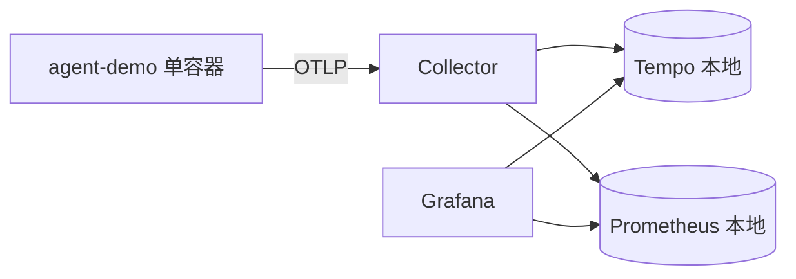
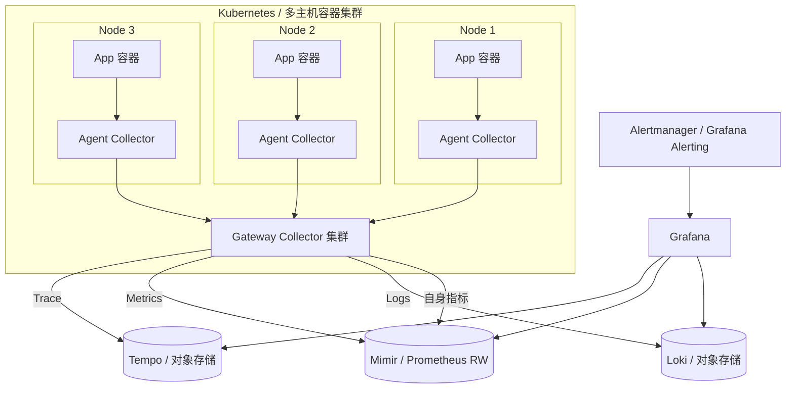

# 多容器应用可观测性管理方案

## 1. 文档信息

| 项 | 内容 |
| --- | --- |
| 文档名称 | 多容器应用可观测性管理方案 |
| 项目 | agent-demo（从单机 Demo 演进到多容器/多服务观测平台） |
| 版本 | v1.0 |
| 状态 | 方案设计 |
| 关联文档 | `docs/observability-prd.md`（单应用可观测性 PRD） |
| 关联代码 | `src/agent_demo/telemetry.py`、`deploy/` |

---

## 2. 背景与现状

### 2.1 现状架构

当前 Demo 是**单应用、单主机、单 Compose** 的可观测性 MVP：



- 一个应用，`docker compose` 编排在单台机器。
- Tempo / Prometheus 使用**本地磁盘**存储，保留期极短（Tempo 1h、Prometheus 24h）。
- 无鉴权、无租户、无告警、无采样。
- 资源标识仅有 `service.name` / `service.version` / `deployment.environment`。

### 2.2 现状局限

| 维度 | 现状 | 多容器场景的问题 |
| --- | --- | --- |
| 拓扑 | 单 Collector | 无法就近采集、跨主机汇聚 |
| 发现 | 静态 | 容器频繁调度，服务/实例身份不稳定 |
| 资源标识 | 3 个属性 | 无法区分集群/命名空间/工作负载/Pod/容器 |
| 存储 | 本地磁盘 | 容量、保留期、高可用均不达标 |
| 成本 | 无控制 | 全量上报导致存储与带宽爆炸 |
| 治理 | 无规范 | 指标基数失控、命名混乱 |
| 告警 | 无 | 故障无法主动发现 |
| 安全 | 匿名 Admin | 多团队场景无隔离与权限 |

### 2.3 目标

构建一套可支撑**多服务、多容器、多主机（集群）** 的统一可观测性方案，实现：

1. **统一接入**：任意语言/任意容器的应用都能以统一规范接入。
2. **弹性采集**：Collector 分层（就近 Agent + 汇聚 Gateway），支持水平扩展。
3. **可控成本**：分级采样、属性治理、基数控制、保留期分级。
4. **统一存储**：Trace/Metrics/Logs 三类信号，对象存储与远程写支撑规模化。
5. **统一可视与告警**：Grafana 单一入口，跨服务 Service Map，告警闭环。
6. **可治理**：命名规范、租户隔离、权限与安全。
7. **可演进**：从当前 Demo **平滑迁移**，不推翻已有埋点。

---

## 3. 设计原则

| 原则 | 说明 |
| --- | --- |
| 标准化 | 遵循 OpenTelemetry 语义约定（Resource / Span / Metric / GenAI），后端可替换 |
| 分层解耦 | 采集、处理、存储、展示各层独立扩展 |
| 就近采集 | Agent 贴近应用，减少跨节点流量；Gateway 统一治理与出口 |
| 成本可控 | 源头采样 + 网关尾采样 + 保留期分级 |
| 配置即代码 | Collector 配置、Dashboard、告警、Helm values 全部版本化 |
| 默认安全 | mTLS、鉴权、租户隔离、敏感数据脱敏 |
| 可观测自身 | Collector/存储组件自身指标纳入监控（自监控闭环） |

---

## 4. 总体架构

### 4.1 目标分层架构



### 4.2 分层职责

| 层 | 组件 | 职责 |
| --- | --- | --- |
| 应用接入层 | OTel SDK / Operator / Sidecar | 产生标准化遥测数据 |
| 采集层 | Agent Collector（DaemonSet） | 就近接收、补充节点/容器属性、初筛 |
| 汇聚层 | Gateway Collector（Deployment + LB） | 集中处理、尾采样、路由、出口 |
| 存储层 | Tempo / Mimir(或 Prometheus) / Loki | 三类信号持久化 |
| 展示层 | Grafana | 统一查询、仪表盘、Service Map、Explore |
| 告警层 | Grafana Alerting / Alertmanager | 规则评估与通知 |
| 治理层 | GitOps / CI | 配置、仪表盘、告警版本化 |

---

## 5. 应用接入层

### 5.1 三种接入方式

| 方式 | 适用 | 优点 | 缺点 |
| --- | --- | --- | --- |
| SDK 手动/半自动埋点 | 自研服务（如 agent-demo） | 语义最丰富，可定制 | 需改代码 |
| OpenTelemetry Operator 自动注入 | 标准框架（Java/Go/Node/Python 等） | 零改代码 | 语义较浅，版本受控 |
| Sidecar Collector | 无法安装 Operator、需强隔离 | 隔离性好 | 每 Pod 一份资源开销 |

**建议**：自研核心服务用 SDK（延续现有 `telemetry.py`）；存量服务用 Operator 自动注入；特殊/遗留服务用 Sidecar 兜底。

### 5.2 统一接入规范

1. **必须**通过 `OTEL_EXPORTER_OTLP_ENDPOINT` 指向 Agent Collector（如 `http://otel-agent.observability.svc:4317`）。
2. **必须**设置 `OTEL_RESOURCE_ATTRIBUTES`（或由 Operator/Agent 注入）关键资源属性。
3. **必须**遵循 `service.name` 命名规范（见 §8.3）。
4. **建议**统一使用 OTLP gRPC；HTTP 仅用于不便使用 gRPC 的场景。

### 5.3 资源属性规范

| 属性 | 来源 | 示例 | 必填 |
| --- | --- | --- | --- |
| `service.name` | 应用 | `agent-demo` | 是 |
| `service.namespace` | 应用 | `ai-platform` | 是 |
| `service.version` | 构建注入 | `1.4.2` | 是 |
| `deployment.environment` | 环境 | `prod` / `staging` | 是 |
| `k8s.cluster.name` | Agent/Operator | `prod-cn-beijing` | 是 |
| `k8s.namespace.name` | k8sattributes | `ai-platform` | 自动 |
| `k8s.deployment.name` | k8sattributes | `agent-demo` | 自动 |
| `k8s.pod.name` / `k8s.pod.uid` | k8sattributes | `agent-demo-xxx` | 自动 |
| `k8s.container.name` | k8sattributes | `app` | 自动 |
| `k8s.node.name` | resourcedetection | `node-01` | 自动 |
| `service.instance.id` | 应用/SDK | Pod 名或 UUID | 建议 |

> 现有 `telemetry.py` 已设置 `service.name` / `service.version` / `deployment.environment`，迁移时补充 `service.namespace` 即可。

---

## 6. 采集层：Collector 拓扑

### 6.1 拓扑选型

| 拓扑 | 说明 | 适用规模 | 取舍 |
| --- | --- | --- | --- |
| 单 Collector | 一个实例接收全部 | 小规模/单机 | 单点、难扩展 |
| **Agent + Gateway（推荐）** | DaemonSet 就近采集 + Deployment 汇聚 | 中大规模、多节点 | 部署略复杂，扩展性最佳 |
| Sidecar | 每 Pod 一个 | 强隔离/多租户 | 资源开销大 |
| Agent only | 仅 DaemonSet 直连后端 | 中小规模 | 无集中尾采样/路由 |

### 6.2 Agent Collector（DaemonSet）

职责：
- 接收本节点上所有 Pod 的 OTLP。
- 通过 `k8sattributes` 补充 Pod/Namespace/Deployment 属性。
- `resourcedetection` 补充节点/主机属性。
- 基础 `memory_limiter` + `batch`，转发到 Gateway。

```yaml
# deploy/k8s/otel-agent-daemonset.yaml（片段）
receivers:
  otlp:
    protocols:
      grpc: { endpoint: 0.0.0.0:4317 }
      http: { endpoint: 0.0.0.0:4318 }
processors:
  memory_limiter: { check_interval: 2s, limit_percentage: 75, spike_limit_percentage: 20 }
  k8sattributes:
    auth_type: serviceAccount
    extract:
      metadata: [k8s.namespace.name, k8s.deployment.name, k8s.pod.name, k8s.pod.uid, k8s.node.name, k8s.container.name]
    pod_association:
      - sources: [{ from: resource_attribute, name: k8s.pod.ip }]
      - sources: [{ from: connection }]
  resourcedetection:
    detectors: [env, system]
    system: { hostname_sources: [os] }
  batch: { send_batch_size: 2048, timeout: 5s }
exporters:
  otlp/gateway:
    endpoint: otel-gateway.observability.svc:4317
    tls: { insecure: false }
service:
  pipelines:
    traces:  { receivers: [otlp], processors: [memory_limiter, k8sattributes, resourcedetection, batch], exporters: [otlp/gateway] }
    metrics: { receivers: [otlp], processors: [memory_limiter, k8sattributes, resourcedetection, batch], exporters: [otlp/gateway] }
    logs:    { receivers: [otlp], processors: [memory_limiter, k8sattributes, resourcedetection, batch], exporters: [otlp/gateway] }
```

### 6.3 Gateway Collector（Deployment + HPA）

职责：
- 集中处理：尾采样、属性治理、路由、脱敏。
- 出口：分别写 Tempo / Mimir / Loki。
- 通过 Service + HPA 水平扩展；上游可用 `loadbalancing` exporter 做一致性哈希。

```yaml
# deploy/k8s/otel-gateway-configmap.yaml（片段）
processors:
  memory_limiter: { check_interval: 2s, limit_percentage: 80, spike_limit_percentage: 25 }
  tail_sampling:
    decision_wait: 10s
    num_traces: 100000
    policies:
      - name: errors            # 错误全留
        type: status_code
        status_code: { status_codes: [ERROR] }
      - name: slow              # 慢请求全留
        type: latency
        latency: { threshold_ms: 2000 }
      - name: important-svc     # 核心服务提高比例
        type: and
        and:
          and_sub_policy:
            - name: svc
              type: string_attribute
              string_attribute: { key: service.name, values: [agent-demo], enabled_regex_matching: true, invert_match: false }
            - name: pct
              type: probabilistic
              probabilistic: { sampling_percentage: 50 }
      - name: default           # 其余 5%
        type: probabilistic
        probabilistic: { sampling_percentage: 5 }
  attributes/strip:
    actions:
      - key: http.request.header.authorization
        action: delete
      - key: gen_ai.prompt
        action: delete
  transform/drop_noise:
    error_mode: ignore
    trace_statements:
      - context: span
        statements:
          - set(attributes["env"], resource.attributes["deployment.environment"])
exporters:
  otlp/tempo:
    endpoint: tempo-distributor.observability.svc:4317
    tls: { insecure: false }
  prometheusremotewrite/mimir:
    endpoint: http://mimir.observability.svc:9009/api/v1/push
  loki:
    endpoint: http://loki-gateway.observability.svc:3100/loki/api/v1/push
  loadbalancing:
    protocol: { otlp: { tls: { insecure: false } } }
    routing_key: traceID
    resolver:
      static: { hostnames: [otel-gateway-0.otel-gateway:4317, otel-gateway-1.otel-gateway:4317] }
service:
  pipelines:
    traces:
      receivers: [otlp]
      processors: [memory_limiter, tail_sampling, attributes/strip, transform/drop_noise, batch]
      exporters: [otlp/tempo]
    metrics:
      receivers: [otlp]
      processors: [memory_limiter, attributes/strip, batch]
      exporters: [prometheusremotewrite/mimir]
    logs:
      receivers: [otlp]
      processors: [memory_limiter, attributes/strip, batch]
      exporters: [loki]
```

### 6.4 关键处理器说明

| 处理器 | 作用 |
| --- | --- |
| `memory_limiter` | 内存保护，防 OOM（**必须置于 pipeline 首位**） |
| `k8sattributes` | 从 k8s API 补充 Pod/Deployment 等元数据 |
| `resourcedetection` | 探测主机/节点/云环境属性 |
| `tail_sampling` | 基于 Trace 全貌采样（错误/慢请求全留） |
| `attributes` / `transform` | 增删改属性、脱敏、派生字段 |
| `filter` | 按条件丢弃噪声（如健康检查 span） |
| `routing` | 按属性路由到不同出口/租户 |
| `batch` | 批量发送，降低网络与后端压力 |

---

## 7. 数据处理与治理

### 7.1 采样策略（成本核心）

| 层级 | 手段 | 说明 |
| --- | --- | --- |
| 源头 | SDK `TraceIdRatioBased` / 父采样 | 高频、低价值服务在源头降采样 |
| 网关 | `tail_sampling` | 保留错误、慢请求、核心服务 |
| 指标 | 预聚合 + 基数控制 | 避免高基数标签 |
| 日志 | 级别过滤 + 采样 | 仅保留 WARN 及以上或采样 |

**推荐组合**：错误 100% + P99 慢请求 100% + 核心服务 50% + 其余 5%。

### 7.2 属性治理

- **禁止**上报：密钥、Token、Authorization Header、Prompt/Completion 正文、PII。
- 统一在 Gateway 用 `attributes`/`transform` 做删除与重命名。
- 建立**属性白名单**，未在清单内的自定义属性需评审。

### 7.3 基数控制

- 指标 label 基数上限（如单指标 < 10 万 series）。
- 禁止把 `user.id`、`trace.id`、原始 URL 作为 label。
- 使用 `metricstransform` / `filter` 裁剪高基数维度。

### 7.4 命名规范

| 类型 | 规范 | 示例 |
| --- | --- | --- |
| service.name | 小写、连字符、全局唯一 | `agent-demo` |
| service.namespace | 业务域 | `ai-platform` |
| 自定义指标 | 域.对象.动作，带单位 | `agent.tokens`（`{token}`） |
| 自定义 Span | 遵循语义约定动词 | `invoke_agent`、`execute_tool` |
| 环境 | 固定枚举 | `dev`/`staging`/`prod` |

---

## 8. 存储层

### 8.1 三类信号选型

| 信号 | 小规模 | 规模化（推荐） | 说明 |
| --- | --- | --- | --- |
| Traces | Tempo（本地） | **Tempo + 对象存储（S3/OSS）** | 块存储、按租户隔离 |
| Metrics | Prometheus（本地） | **Mimir / Thanos / VictoriaMetrics** | 长期存储、多租户、水平扩展 |
| Logs | Loki（本地） | **Loki + 对象存储** | 与 Trace 通过 TraceID 关联 |

> 迁移路径：Prometheus 可先保留，通过 `remote_write` 写入 Mimir 双写过渡。

### 8.2 存储与保留策略

| 信号 | 热存储 | 冷存储 | 保留 |
| --- | --- | --- | --- |
| Traces | Tempo ingester | 对象存储 | 7~30 天 |
| Metrics | Prometheus/Mimir 本地 | 对象存储（长期） | 15 天~13 月（分级） |
| Logs | Loki ingester | 对象存储 | 7~30 天 |

### 8.3 容量估算（示例）

假设：`S` 个服务，平均 `R` 请求/秒，每请求 `P` 个 span，每 span `B` 字节，保留 `D` 天。

```
日增存储 ≈ S × R × P × B × 86400
总存储   ≈ 日增存储 × D × 副本系数(1.3)
```

示例：`S=20, R=50, P=8, B=1.5KB, D=7`

```
日增 ≈ 20 × 50 × 8 × 1.5KB × 86400 ≈ 1.0 TB/天  → 7 天约 7.3 TB（含副本）
```

> 未采样全量上报成本极高，**必须**结合 §7.1 采样（如 5% 采样后约 365 GB/7天）。

### 8.4 Helm 部署示例

```bash
# Tempo（对象存储）
helm install tempo grafana/tempo-distributed -n observability -f values-tempo.yaml
# Mimir（指标长期存储）
helm install mimir grafana/mimir-distributed -n observability -f values-mimir.yaml
# Loki（日志）
helm install loki grafana/loki -n observability -f values-loki.yaml
# Grafana
helm install grafana grafana/grafana -n observability -f values-grafana.yaml
```

---

## 9. 可视化与告警

### 9.1 Grafana 统一入口

- 数据源：Tempo（Traces）、Mimir/Prometheus（Metrics）、Loki（Logs）。
- 开启关联：
  - `tracesToMetrics`：从 Span 跳到对应指标。
  - `tracesToLogs`：按 TraceID 跳到日志。
  - `serviceMap`：基于 span metrics 生成服务拓扑。
- 采用 **Dashboard as Code**：JSON 存 Git，通过 provisioning / Grafana Operator 自动同步。

### 9.2 跨服务 Service Map

Gateway 开启 `spanmetrics` connector，从 Trace 派生服务间调用指标（RED）：

```yaml
connectors:
  spanmetrics:
    histogram: { explicit: { buckets: [10ms, 50ms, 100ms, 500ms, 1s, 2s, 5s] } }
    dimensions:
      - name: http.method
      - name: http.status_code
      - name: gen_ai.request.model
      - name: gen_ai.tool.name
service:
  pipelines:
    traces:  { receivers: [otlp], processors: [tail_sampling, batch], exporters: [otlp/tempo, spanmetrics] }
    metrics/spanmetrics: { receivers: [spanmetrics], exporters: [prometheusremotewrite/mimir] }
```

### 9.3 告警

| 告警 | 条件（示例） | 级别 |
| --- | --- | --- |
| 高错误率 | `sum(rate(agent_requests_total{agent_status="error"}[5m])) / sum(rate(agent_requests_total[5m])) > 5%` | P2 |
| LLM P95 延迟 | `histogram_quantile(0.95, ...) > 10s` 持续 10m | P2 |
| 工具失败率 | `agent_tool_calls_total{tool.status="error"}` 占比 > 10% | P2 |
| Token 成本激增 | token 速率环比 > 200% | P3 |
| Collector 掉线 | `up{job="otel-collector"} == 0` | P1 |
| 采样丢弃过高 | `otelcol_processor_dropped_spans` 激增 | P3 |

- 统一使用 **Grafana Alerting**（或 Alertmanager）评估，路由到企业微信/钉钉/Slack/PagerDuty。
- 告警规则版本化在 Git。

---

## 10. 多环境与多租户

### 10.1 多环境

- 通过 `deployment.environment`（dev/staging/prod）区分，独立命名空间与存储后端。
- 生产与测试 Collector 独立部署，避免相互影响。

### 10.2 多租户

- **软隔离**：`service.namespace` / 自定义 `tenant` 属性 + Grafana 组织/文件夹 + 数据源查询过滤。
- **硬隔离**：Tempo/Mimir/Loki 原生多租户（`X-Scope-OrgID`），Gateway 用 `routing` processor 按租户头/属性写入。
- Grafana 用 **RBAC** 控制团队可见范围。

```yaml
# 按租户头路由示例
processors:
  routing:
    default_exporters: [prometheusremotewrite/mimir]
    attribute_source: resource
    from_attribute: tenant
    table:
      - value: team-a
        exporters: [prometheusremotewrite/mimir]
```

---

## 11. 安全

| 面向 | 措施 |
| --- | --- |
| 传输 | Collector 之间、Collector 到后端启用 mTLS |
| 认证 | OTLP 接收端启用 Bearer Token / OAuth2 |
| 授权 | Grafana RBAC + 组织隔离；存储多租户 |
| 密钥 | 使用 K8s Secret / 外部密钥管理（Vault），不落盘、不入镜像 |
| 脱敏 | Gateway 统一删除敏感属性（Header、Prompt、PII） |
| 网络 | 仅集群内可达 Collector；出网白名单 |
| 审计 | 保留配置变更与访问审计 |

---

## 12. 部署与 CI/CD

### 12.1 建议目录结构

```
deploy/
├── docker-compose.yml          # 保留：本地/单机 Demo
├── Dockerfile
├── helm/                       # 新增：集群化部署
│   ├── otel-agent/             # DaemonSet
│   ├── otel-gateway/           # Deployment + HPA + Service
│   ├── tempo/
│   ├── mimir/
│   ├── loki/
│   └── grafana/
├── k8s/                        # 原生 YAML（或由 Helm 生成）
│   ├── otel-agent-daemonset.yaml
│   ├── otel-gateway-deployment.yaml
│   └── otel-gateway-configmap.yaml
└── gitops/                     # ArgoCD / Flux 应用清单
```

### 12.2 交付方式

- **配置即代码**：Collector 配置、仪表盘 JSON、告警规则全部进 Git。
- **GitOps**：ArgoCD/Flux 同步 Helm values 与配置，变更可审计、可回滚。
- **CI 校验**：流水线执行 `otelcol validate --config`、`helm lint`、仪表盘 JSON schema 校验。

### 12.3 应用侧变更（延续现有实现）

- 复用 `telemetry.py`，仅新增 `service.namespace` 资源属性。
- 通过环境变量注入 OTLP 端点，代码零改动：

```yaml
env:
  - name: OTEL_EXPORTER_OTLP_ENDPOINT
    value: http://otel-agent.observability.svc:4317
  - name: OTEL_SERVICE_NAME
    value: agent-demo
  - name: OTEL_RESOURCE_ATTRIBUTES
    value: service.namespace=ai-platform,deployment.environment=prod
```

---

## 13. 迁移路线


| 阶段 | 目标 | 关键动作 | 产出 |
| --- | --- | --- | --- |
| 0 现状 | 单应用观测 | 已完成（Tempo/Prometheus/Grafana 本地） | 现有 `deploy/` |
| 1 标准化 | 统一接入规范 | 补 `service.namespace`；约定命名与资源属性；配置化 | 接入规范、`telemetry.py` 微调 |
| 2 采集分层 | Agent + Gateway | 部署 DaemonSet Agent 与 Gateway；k8sattributes；Service/HPA | `deploy/helm/otel-*` |
| 3 规模存储 | 对象存储 + 长期指标 | Tempo/Mimir/Loki + 对象存储；Prometheus remote_write 双写过渡 | 存储 Helm charts |
| 4 治理告警 | 成本与可靠性 | 尾采样、属性脱敏、基数控制、告警规则、Service Map | 采样/告警配置、Runbook |
| 5 平台化 | 多租户自助 | 多租户隔离、RBAC、自服务仪表盘、Operator 自动注入 | 平台能力与文档 |

**每阶段验收**：数据不丢、延迟可接受、成本可控、回滚可行。

---

## 14. 运维与 SLO

### 14.1 可观测性平台自身 SLO

| 指标 | 目标 |
| --- | --- |
| 数据接收可用性 | ≥ 99.9% |
| 端到端可见延迟（采集到可查） | ≤ 60s |
| 采样正确性（错误不丢） | 100% |
| Collector 资源利用率 | CPU < 70%，内存 < 80% |

### 14.2 自监控

- Collector 暴露自身指标（`otelcol_*`），纳入 Mimir/Prometheus。
- 监控：接收/拒绝/丢弃 span 数、队列长度、导出失败、内存使用。
- 关键告警见 §9.3。

### 14.3 Runbook 要点

- Collector 掉线：检查 HPA/资源、上游端点、mTLS 证书。
- 数据丢失：核对采样策略与 `memory_limiter` 丢弃计数。
- 存储告警：扩容对象存储、调整保留期/采样率。

---

## 15. 风险与取舍

| 风险 | 影响 | 缓解 |
| --- | --- | --- |
| 采样过度 | 丢失关键链路 | 错误/慢请求强制保留；采样率可配可观测 |
| 基数失控 | 存储与查询爆炸 | 属性白名单 + 基数上限 + 定期审计 |
| Collector 成为瓶颈 | 数据延迟/丢失 | Agent+Gateway 分层、HPA、loadbalancing |
| 成本超预算 | 存储费用高 | 分级保留、对象存储、采样、成本看板 |
| 迁移中断业务 | 可用性下降 | 分阶段、双写过渡、可回滚 |
| 多租户越权 | 数据泄露 | 硬隔离 + RBAC + 审计 |

---

## 16. 附录

### 16.1 落地检查清单

- [ ] 所有服务统一 `service.name` / `service.namespace` / `deployment.environment`
- [ ] 应用 OTLP 端点指向 Agent Collector
- [ ] Agent DaemonSet 覆盖所有节点，`k8sattributes` 生效
- [ ] Gateway 配置 `memory_limiter`（首位）+ `tail_sampling` + 脱敏
- [ ] Trace/Metrics/Logs 分别写入 Tempo/Mimir/Loki
- [ ] Grafana 数据源关联（tracesToMetrics / tracesToLogs / serviceMap）
- [ ] 告警规则上线并验证通知链路
- [ ] 配置、仪表盘、告警全部版本化并 GitOps 同步
- [ ] 平台自监控与 SLO 看板就绪
- [ ] 容量与成本基线建立

### 16.2 组件版本参考

| 组件 | 建议版本 |
| --- | --- |
| OpenTelemetry Collector Contrib | ≥ 0.111.0 |
| OpenTelemetry Operator | 最新稳定版 |
| Tempo | ≥ 2.6 |
| Mimir / Prometheus | Mimir ≥ 2.13 / Prometheus ≥ 2.55 |
| Loki | ≥ 3.0 |
| Grafana | ≥ 11.3 |

### 16.3 与现有 Demo 的对应关系

| 现状 | 目标演进 |
| --- | --- |
| 单 Collector（`deploy/otel-collector`） | Agent + Gateway 分层 |
| Tempo 本地存储 | Tempo + 对象存储 / 多租户 |
| Prometheus 本地 | Mimir/Prometheus remote_write |
| 无日志 | Loki 接入 |
| 匿名 Admin Grafana | RBAC + 多租户 |
| 无采样 | 源头 + 尾采样 |
| 无告警 | Grafana Alerting / Alertmanager |
| 3 个资源属性 | 完整 K8s 资源属性 |
| `docker-compose` | Helm + GitOps |
