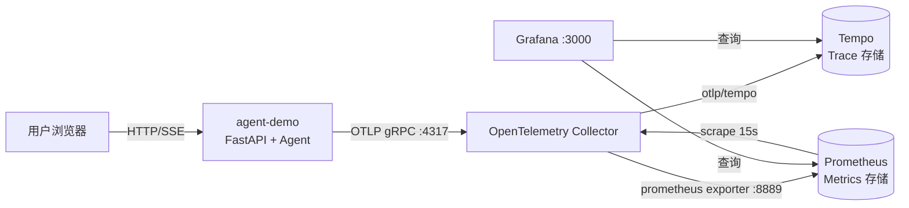

# Agent 应用可观测性（OpenTelemetry + Grafana）PRD

## 1. 文档信息

| 项 | 内容 |
| --- | --- |
| 文档名称 | Agent 应用可观测性建设 PRD |
| 项目名称 | agent-demo |
| 版本 | v1.0 |
| 状态 | 已实现（MVP 已上线并验证） |
| 关联模块 | `src/agent_demo/telemetry.py`、`src/agent_demo/agent.py`、`src/agent_demo/web.py`、`deploy/` |
| 技术栈 | Python 3.10+ / OpenTelemetry SDK / OpenTelemetry Collector / Tempo / Prometheus / Grafana / Docker Compose |

---

## 2. 背景与目标

### 2.1 背景

agent-demo 是一个基于 OpenAI SDK 的 tool-calling Agent 应用，提供 CLI 与 Web（SSE 流式）两种交互方式。随着使用场景增加，以下问题逐渐暴露：

- 无法回答“一次问答耗时多少、慢在哪一步”。
- 无法统计 LLM 的 token 消耗与成本趋势。
- 工具（tool）调用成功率、调用分布不可见。
- 线上问题（LLM 报错、工具异常）缺少可追溯的链路上下文。

### 2.2 目标

1. **可观测性**：为 Agent 应用引入 Trace + Metrics 两类遥测数据，覆盖「请求 → Agent 回合 → LLM 调用 → 工具调用」全链路。
2. **标准化**：遵循 OpenTelemetry 语义约定（尤其 GenAI Semantic Conventions），保证数据可被通用后端消费。
3. **可视化**：通过 OpenTelemetry Collector 将数据分发到 Tempo（Trace）与 Prometheus（Metrics），并在 Grafana 中统一展示。
4. **低侵入、可开关**：遥测能力对业务代码低侵入，支持一键关闭（`OTEL_ENABLED=false`），未部署后端时不影响主流程。
5. **一键部署**：提供 Docker Compose 编排，一条命令拉起完整监控栈。

### 2.3 非目标（本期不做）

- 不做日志（Logs）采集与 Loki 接入。
- 不做告警规则与通知（Alerting / On-call）。
- 不做多租户、鉴权与生产级高可用存储（Tempo/Prometheus 均为单实例本地存储）。
- 不做 OpenTelemetry 自动注入（auto-instrumentation agent / Operator）。
- 不做 LLM Prompt / Completion 正文采集（仅采集 token 计数与元数据，规避隐私风险）。

---

## 3. 术语

| 术语 | 说明 |
| --- | --- |
| Trace | 一次完整请求的调用链，由多个 Span 组成 |
| Span | 调用链中的一个操作单元，含名称、时间、属性、状态 |
| Metric | 数值型时序指标（Counter / Histogram / Gauge） |
| OTLP | OpenTelemetry Protocol，遥测数据传输协议（gRPC / HTTP） |
| Collector | OpenTelemetry Collector，遥测数据的接收、处理、导出组件 |
| Tempo | Grafana 出品的分布式 Trace 存储 |
| Prometheus | 指标时序数据库与查询引擎 |
| Resource | 遥测数据所属实体（如 service.name、service.version） |

---

## 4. 用户与场景

| 角色 | 诉求 | 对应能力 |
| --- | --- | --- |
| 应用开发者 | 定位一次慢请求的瓶颈（LLM 还是工具） | Tempo Trace 瀑布图 |
| 应用开发者 | 查看某次问答的 token 消耗与工具调用 | Span 属性 / Trace 详情 |
| 运维/SRE | 观察请求量、错误率、延迟趋势 | Grafana 指标面板 |
| 成本关注者 | 观察 token 消耗速率与结构 | Token usage 面板 |
| 平台工程师 | 接入新服务、扩展数据管道 | Collector / Compose 配置 |

**核心用户旅程**

1. 用户在 Web 页面发起一次问答。
2. 应用产生 `invoke_agent` → `chat` → `execute_tool` 的 Trace，以及请求/token/工具/延迟指标。
3. 遥测数据经 OTLP 上报至 Collector。
4. Collector 将 Trace 写入 Tempo、将 Metrics 暴露给 Prometheus。
5. 用户在 Grafana 仪表盘查看趋势，并下钻到 Tempo 查看单次链路。

---

## 5. 总体架构



**数据流**

| 数据 | 产生方 | 传输 | 处理 | 存储 | 展示 |
| --- | --- | --- | --- | --- | --- |
| Trace | 应用 SDK | OTLP gRPC → Collector:4317 | memory_limiter → batch | Tempo | Grafana Explore |
| Metrics | 应用 SDK | OTLP gRPC → Collector:4317 | memory_limiter → batch | Prometheus（抓取 Collector:8889） | Grafana Dashboard |

**资源模型（Resource Attributes）**

| 属性 | 取值 | 说明 |
| --- | --- | --- |
| `service.name` | `OTEL_SERVICE_NAME`，默认 `agent-demo` | 服务标识，Grafana 过滤依据 |
| `service.version` | `0.1.0` | 服务版本 |
| `deployment.environment` | `DEPLOYMENT_ENV`，默认 `dev` | 环境标识 |

---

## 6. 功能需求

### FR-1 应用自动埋点（HTTP 层）

- 使用 `opentelemetry-instrumentation-fastapi` 对 FastAPI 自动埋点。
- 每个 HTTP 请求生成 server span，携带 `http.method`、`http.route`、`http.status_code` 等标准属性。
- 产出 `http.server.*` 指标（请求量、时延）。

**验收**：`GET /` 产生名为 `GET /` 的 server span，`http.method=GET`。

### FR-2 Agent 链路埋点（Trace）

应用在关键路径手动创建 Span，形成三层调用结构：

```
invoke_agent agent-demo              # 一次用户问答（Agent 回合）
├── chat <model>                     # 每次 LLM 调用（可能多次，取决于工具循环）
└── execute_tool <tool_name>         # 每次工具调用
```

- Span 之间通过显式 parent context 关联，避免生成器（streaming）跨 yield 导致的上下文丢失。
- 异常时记录 `record_exception` 并设置 `error.type`。
- HTTP 请求的 server span 上追加业务属性 `agent.session_id`。

**Span 属性定义**

| Span | 属性 | 含义 |
| --- | --- | --- |
| `invoke_agent agent-demo` | `gen_ai.system` | 模型供应商，固定 `openai` |
| | `gen_ai.operation.name` | `invoke_agent` |
| | `gen_ai.request.model` | 请求模型名 |
| `chat <model>` | `gen_ai.system` / `gen_ai.operation.name=chat` / `gen_ai.request.model` | 同上 |
| | `gen_ai.response.model` | 响应模型名 |
| | `gen_ai.usage.input_tokens` | 输入 token 数 |
| | `gen_ai.usage.output_tokens` | 输出 token 数 |
| `execute_tool <name>` | `gen_ai.operation.name` | `execute_tool` |
| | `gen_ai.tool.name` | 工具名 |
| | `gen_ai.tool.call.id` | 工具调用 ID |
| 任意 Span | `error.type` | 异常类型（仅异常时） |

### FR-3 指标采集（Metrics）

| 指标名 | 类型 | 单位 | 属性 | 含义 |
| --- | --- | --- | --- | --- |
| `agent.requests` | Counter | `{request}` | `agent.status`(success/error) | 问答请求数 |
| `agent.tokens` | Counter | `{token}` | `token.type`(input/output)、`gen_ai.request.model` | LLM token 消耗 |
| `agent.llm.duration` | Histogram | `s` | `gen_ai.request.model` | LLM 调用耗时 |
| `agent.tool.calls` | Counter | `{call}` | `gen_ai.tool.name`、`tool.status`(success/error) | 工具调用数 |

> 说明：指标采用点号命名 + 语义约定属性；经 OTel Prometheus Exporter 导出后自动转换（见 §8.3）。

### FR-4 流式场景 token 采集

- 流式请求默认携带 `stream_options={"include_usage": true}` 以获取 token 用量。
- 若供应商不支持（返回 400 `BadRequestError`），自动降级重试（不带 `stream_options`），不影响主流程。
- 由 `LLM_INCLUDE_USAGE`（默认 `true`）控制开关。

### FR-5 数据管道

Collector 职责：

- **接收**：OTLP gRPC(4317) / HTTP(4318)。
- **处理**：`memory_limiter`（内存保护）+ `batch`（批量发送）。
- **导出**：
  - Traces → `otlp/tempo`（Tempo:4317）。
  - Metrics → `prometheus` exporter（监听 8889，供 Prometheus 抓取）。
  - `resource_to_telemetry_conversion` 开启，将 resource 属性转为指标 label（如 `service_name`）。

### FR-6 存储

- **Tempo**：本地存储，保留 1h（`block_retention: 1h`），HTTP 端口 3200。
- **Prometheus**：抓取 `otel-collector:8889`，间隔 15s，数据保留 24h。

### FR-7 可视化

Grafana 预置数据源与仪表盘：

- 数据源：`Prometheus`(uid=prometheus，默认)、`Tempo`(uid=tempo，含 tracesToMetrics / serviceMap / nodeGraph)。
- 仪表盘：**agent-demo Observability**（uid=`agent-demo-obs`，folder=`agent-demo`，10s 自动刷新）。

| 面板 | 类型 | 查询 |
| --- | --- | --- |
| Total requests | Stat | `sum(agent_requests_total)` |
| Error rate | Stat | `sum(rate(agent_requests_total{agent_status="error"}[$__rate_interval])) / clamp_min(sum(rate(agent_requests_total[$__rate_interval])), 0.000001)` |
| LLM latency p95 | Stat | `histogram_quantile(0.95, sum by (le) (rate(agent_llm_duration_seconds_bucket[$__rate_interval])))` |
| Request rate by status | Timeseries | `sum by (agent_status) (rate(agent_requests_total[$__rate_interval]))` |
| LLM latency quantiles | Timeseries | p50 / p95 / p99 |
| Token usage rate by type | Timeseries | `sum by (token_type) (rate(agent_tokens_total[$__rate_interval]))` |
| Tool calls by tool | Timeseries | `sum by (gen_ai_tool_name) (rate(agent_tool_calls_total[$__rate_interval]))` |
| Traces | Text | TraceQL 查询指引 |

### FR-8 配置与开关

- 通过环境变量控制遥测行为（见 §8.4）。
- `OTEL_ENABLED=false` 时全部埋点退化为 no-op，不创建 Provider、不导出、不报错。
- `setup_telemetry()` 幂等，可重复调用。

### FR-9 部署

- `deploy/docker-compose.yml` 编排 5 个服务：`app`、`otel-collector`、`tempo`、`prometheus`、`grafana`。
- 支持两种运行形态：
  - **全容器**：`docker compose up -d --build`，应用与监控栈同网络，应用上报到 `http://otel-collector:4317`。
  - **混合**：应用在宿主机运行（`agent-web`），监控栈在 Docker，应用上报到 `http://localhost:4317`。

---

## 7. 详细设计

### 7.1 代码结构

```
src/agent_demo/
├── telemetry.py   # 遥测初始化 + 埋点辅助函数（唯一 OTel 耦合点）
├── agent.py       # 在 Agent 循环中创建 invoke_agent / chat / execute_tool span 与指标
├── web.py         # FastAPI 自动埋点 + session_id 属性 + 请求计数
└── main.py        # CLI 入口，启动时 setup、退出时 shutdown（flush）
deploy/
├── docker-compose.yml
├── Dockerfile
├── otel-collector/config.yaml
├── tempo/tempo.yaml
├── prometheus/prometheus.yml
└── grafana/
    ├── provisioning/datasources/datasources.yaml
    ├── provisioning/dashboards/dashboards.yaml
    └── dashboards/agent-demo.json
```

### 7.2 遥测模块接口（`telemetry.py`）

| 函数 | 作用 |
| --- | --- |
| `setup_telemetry(service_name=None) -> bool` | 初始化 Tracer/Meter Provider、OTLP 导出器、创建指标仪器；幂等 |
| `shutdown_telemetry()` | flush 并关闭 Provider（进程退出前调用） |
| `start_span(name, attributes=None, context=None)` | 创建 span，可显式指定父上下文 |
| `span_context(span)` | 生成以 span 为父的上下文 |
| `record_request(status)` | 请求计数 |
| `record_token_usage(model, input_tokens, output_tokens)` | token 计数 |
| `record_llm_duration(model, seconds)` | LLM 耗时 |
| `record_tool_call(tool_name, status)` | 工具调用计数 |

### 7.3 指标 → Prometheus 名称映射

OTel Prometheus Exporter 规则：点号转下划线；带单位的直方图追加单位后缀；Counter 追加 `_total`；花括号单位（annotation）不追加。

| OTel 指标 | Prometheus 指标 |
| --- | --- |
| `agent.requests` | `agent_requests_total` |
| `agent.tokens` | `agent_tokens_total` |
| `agent.llm.duration` | `agent_llm_duration_seconds`（`_bucket`/`_sum`/`_count`） |
| `agent.tool.calls` | `agent_tool_calls_total` |
| `agent.status`（属性） | `agent_status`（label） |
| `token.type`（属性） | `token_type`（label） |
| `gen_ai.tool.name`（属性） | `gen_ai_tool_name`（label） |

### 7.4 环境变量

| 变量 | 默认值 | 说明 |
| --- | --- | --- |
| `OTEL_ENABLED` | `true` | 总开关，`false` 时全量 no-op |
| `OTEL_SERVICE_NAME` | `agent-demo` | `service.name` |
| `OTEL_EXPORTER_OTLP_ENDPOINT` | `http://localhost:4317` | OTLP 端点（容器内为 `http://otel-collector:4317`） |
| `OTEL_METRIC_EXPORT_INTERVAL` | `10000` | 指标导出间隔（ms） |
| `DEPLOYMENT_ENV` | `dev` | `deployment.environment` |
| `LLM_INCLUDE_USAGE` | `true` | 是否请求流式 token 用量 |

### 7.5 关键实现约束

- **生成器上下文**：流式生成器跨 `yield` 恢复时 contextvars 不稳定，故所有子 span 使用显式 `context=` 关联父 span，而非 `start_as_current_span` 跨越 yield。
- **Span 生命周期**：LLM span 在流式迭代的 `finally` 中结束，保证客户端提前断开（GeneratorExit）时也能正确收尾。
- **低耦合**：业务代码仅依赖 `telemetry.py` 暴露的辅助函数；即使 OTel 未安装/未启用，逻辑仍可运行。

---

## 8. 非功能需求

| 类别 | 要求 |
| --- | --- |
| 性能 | 埋点对主流程耗时可忽略；导出为异步批处理（BatchSpanProcessor / PeriodicExportingMetricReader），不阻塞请求 |
| 可靠性 | 后端不可用时不阻断业务；`memory_limiter` 防止 Collector OOM；Provider 支持 shutdown flush |
| 安全 | 不采集 Prompt/Completion 正文；API Key 通过 `.env` 注入，不写入镜像 |
| 兼容性 | 支持任意 OpenAI 兼容 API（OpenAI / DeepSeek / vLLM 等）；供应商不支持 `stream_options` 时自动降级 |
| 可维护性 | 新增指标/属性集中修改 `telemetry.py`；配置全部环境变量化 |
| 可移植性 | 遵循 OTLP 与 GenAI 语义约定，后端可替换为 Jaeger / Mimir 等 |

---

## 9. 验收标准

| 编号 | 验收项 | 期望结果 | 状态 |
| --- | --- | --- | --- |
| AC-1 | 遥测关闭 | `OTEL_ENABLED=false` 时应用正常、无导出 | 通过 |
| AC-2 | Span 层级 | 一次带工具的问答产生 `invoke_agent`→`chat`×N→`execute_tool` | 通过 |
| AC-3 | Token 属性 | `chat` span 含输入/输出 token 属性 | 通过（实测 490/38） |
| AC-4 | 指标导出 | Prometheus 可查询 `agent_requests_total` 等 | 通过 |
| AC-5 | 工具指标 | `agent_tool_calls_total{gen_ai_tool_name="calculator"}=1` | 通过 |
| AC-6 | Trace 存储 | Tempo `/api/search` 可检索到 `POST /api/chat` | 通过 |
| AC-7 | Grafana 数据源 | Prometheus / Tempo 自动就绪 | 通过 |
| AC-8 | Grafana 仪表盘 | `agent-demo-obs` 可访问（HTTP 200） | 通过 |
| AC-9 | 端到端 | Web 页面问答后，指标与链路均可见 | 通过 |

**实测样例**（发送“请用计算器算一下 12*7 等于多少”）：

```
agent_requests_total{agent_status="success"} = 1
agent_tokens_total{token_type="input"} = 490
agent_tokens_total{token_type="output"} = 38
agent_tool_calls_total{gen_ai_tool_name="calculator"} = 1
agent_llm_duration_seconds_count = 2
Tempo trace: POST /api/chat (root=agent-demo)
```

---

## 10. 部署与运维

### 10.1 启动

```bash
# 依赖：Docker（Docker Desktop 需开启 WSL 集成）
docker compose -f deploy/docker-compose.yml up -d --build
```

访问入口：

| 服务 | 地址 |
| --- | --- |
| App | http://localhost:8000 |
| Grafana | http://localhost:3000（匿名 Admin） |
| Prometheus | http://localhost:9090 |
| Tempo | http://localhost:3200 |
| OTLP | localhost:4317 (gRPC) / localhost:4318 (HTTP) |

### 10.2 常用运维命令

```bash
docker compose -f deploy/docker-compose.yml ps
docker compose -f deploy/docker-compose.yml logs -f app
docker compose -f deploy/docker-compose.yml down        # 停止
docker compose -f deploy/docker-compose.yml up -d       # 再启动
```

### 10.3 Trace 查询示例（Grafana Explore → Tempo）

```
{ resource.service.name = "agent-demo" }
```

### 10.4 混合部署注意

- 应用在宿主机运行时，默认上报 `http://localhost:4317`。
- 若宿主机端口与容器冲突（如 8000），需先释放宿主机端口，容器发布端口方可生效。

---

## 11. 风险与限制

| 风险/限制 | 影响 | 缓解 |
| --- | --- | --- |
| Tempo/Prometheus 单实例本地存储 | 无高可用，重启丢数据（Prometheus 有 24h TSDB） | 生产替换为分布式后端 / 对象存储 |
| 数据保留期短（Tempo 1h） | 无法长期回溯 | 调整 `block_retention` 或接对象存储 |
| 供应商不支持 `stream_options` | 流式无 token 指标 | 已实现自动降级；可设 `LLM_INCLUDE_USAGE=false` |
| 匿名 Admin 的 Grafana | 不适用于生产 | 生产启用鉴权与 RBAC |
| 未采集 Prompt/Completion 正文 | 无法直接回看对话内容 | 如需可扩展 span 事件（注意脱敏与合规） |
| 0.0.0.0 监听告警 | 暴露面增大 | 仅内网使用；生产绑定内网地址 |

---

## 12. 后续规划（Roadmap）

1. **日志接入**：接入 Loki，实现 Trace↔Log 关联（TraceID 注入日志）。
2. **告警**：基于错误率、P95 延迟、token 成本配置 Grafana Alerting。
3. **成本看板**：按模型单价折算 token 成本。
4. **GenAI 语义约定补全**：补充 `gen_ai.operation.name`、`gen_ai.request.temperature` 等属性。
5. **多服务**：接入更多 Agent 服务，利用 `service.name` 做跨服务 Service Map。
6. **自动注入**：评估 OpenTelemetry Operator / auto-instrumentation。
7. **生产化存储**：Tempo 对象存储 + Prometheus/Mimir 远程写。

---

## 13. 附录

### 13.1 文件清单

| 文件 | 说明 |
| --- | --- |
| `src/agent_demo/telemetry.py` | 遥测初始化与埋点辅助 |
| `src/agent_demo/agent.py` | Agent 循环内 span/指标埋点 |
| `src/agent_demo/web.py` | FastAPI 自动埋点与请求计数 |
| `src/agent_demo/main.py` | CLI 生命周期管理（setup/shutdown） |
| `deploy/docker-compose.yml` | 监控栈编排 |
| `deploy/Dockerfile` | 应用镜像 |
| `deploy/otel-collector/config.yaml` | Collector 管道配置 |
| `deploy/tempo/tempo.yaml` | Tempo 配置 |
| `deploy/prometheus/prometheus.yml` | Prometheus 抓取配置 |
| `deploy/grafana/provisioning/**` | 数据源与仪表盘自动配置 |
| `deploy/grafana/dashboards/agent-demo.json` | 仪表盘定义 |

### 13.2 版本依赖

| 组件 | 版本 |
| --- | --- |
| Python | ≥ 3.10 |
| OpenTelemetry SDK | ≥ 1.27 |
| opentelemetry-instrumentation-fastapi | ≥ 0.48b0 |
| OpenTelemetry Collector Contrib | 0.111.0 |
| Tempo | 2.6.1 |
| Prometheus | v2.55.0 |
| Grafana | 11.3.0 |
